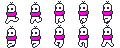

# ChuckYaDer-Full

## Propósito

Este é um projeto acadêmico de Portifólio como Trabalho de Conclusão de Curso em Engenharia de Software para a universidade Católica de Santa Catarina.

## Descrição

Esta versão de 'ChuckYaDer' trata-se de um jogo eletrônico co-operativo de plataforma focado em solução de puzzles. O projeto em si é uma versão completamente refeita e expandida do original, dessa vez rodando na Godot Engine.

## Controles

### Menus

Os menus do jogo são controlados majoritáriamente pelo Mouse, a única exceção sendo a seleção de cores em que cada jogador controla seu cursor, e o botão ESC que pausa o jogo durante gameplay.

### Personagens

Os controles em si podem ser conferidos no menu de Opções e podem também ser alterados, então os controles abaixo são apenas os comandos e não os botões.

Andar (esquerda e direita)

## Documentação do Projeto

Documentação está sendo realizada em Notion. 

Enquanto isso: https://www.notion.so/Game-Design-Doc-1c561f84087e8066940bc3ea033a34d3
